<div align="center">

# Aura AI

**A private AI team with personalities, memory, images, local LLM support, and a native macOS client.**

**Language:** English · [한국어](README.ko.md)

[](https://www.electronjs.org/)
[](AuraNative/)
[](https://react.dev/)
[](https://www.typescriptlang.org/)
[](#privacy-and-local-files)
[](LICENSE)


**Talk to seven distinct AI companions. Keep your memories in plain files. Attach images. Run local when you want privacy.**

**Editions:** Aura AI ships from one repository as an English edition and a Korean edition. The Korean build has Korean UI text, Korean persona names, Korean system prompts, and separate Korean default portraits.

**Native macOS:** `AuraNative/` is Aura's SwiftUI macOS client. It replaces the browser-shell approach on macOS while the established Electron app remains the Windows-compatible release path during the migration.

[Quick Start](#quick-start) · [Editions](#editions) · [Meet The Personas](#meet-the-personas) · [Image Chat](#image-chat) · [Local LLM Setup](#local-llm-setup) · [For Code Agents](#code-agent-handoff-prompt)

</div>

---

## What Is Aura AI?

Aura AI is a desktop chat app for people who want AI to feel less like a command line and more like a small circle of useful companions.

You choose a persona, start a conversation, and Aura keeps the experience personal:

- **Seven built-in personas** with different voices, profile images, and conversation styles.
- **Image uploads in chat** so you can ask about screenshots, designs, photos, or documents.
- **User profile photo upload** in onboarding and Settings, shown beside your own messages.
- **Character-specific memory** so each persona remembers only what they learned with you.
- **Global memory** for manual facts you want every persona to share.
- **Kokoro text-to-speech** for local voice replies, with per-persona voice settings.
- **Beginner local LLM setup** with an in-app model downloader and llama.cpp launcher.
- **Optional cloud providers** for OpenAI, Anthropic, and Gemini.
- **No accounts, no telemetry, no hosted database.**

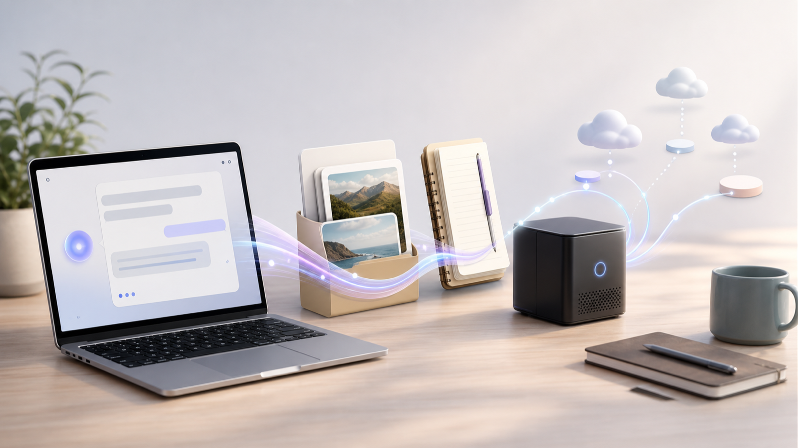

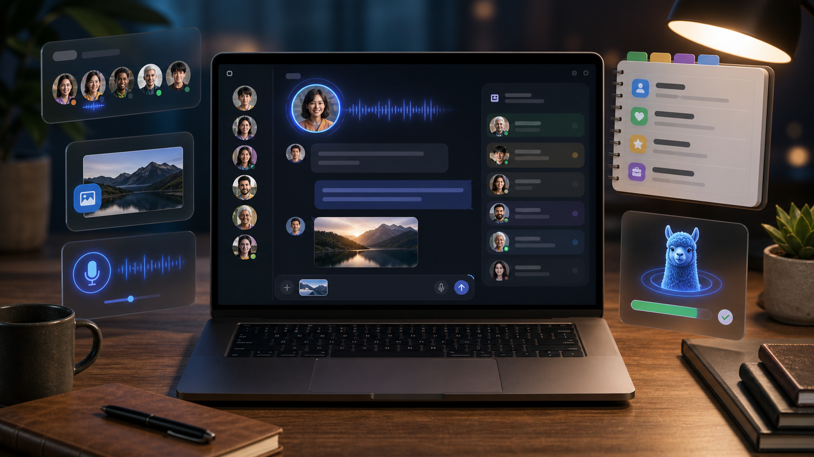

## Quick Start

### Option 1: Download A Release

Installers are produced with Electron Builder:

- macOS: `.dmg` and `.zip`
- Windows: NSIS `.exe`

Release files are attached to GitHub Releases. Local builds write artifacts to the `release/` folder.

### Option 2: Run From Source

```bash
git clone https://github.com/eisenjimmy/AuraAI.git
cd AuraAI
npm install
npm run dev
```

Aura opens a first-run setup flow. Pick a provider, enter your name, choose a persona, and start chatting.

## Editions

Aura keeps one codebase and builds two desktop editions:

| Edition | App name | UI | Persona defaults | Data folder |
|---|---|---|---|---|
| English | Aura AI | English | Nova, Sage, Rio, Luna, Max, Gilleon, Neir | Aura AI |
| Korean | Aura AI Korean / 아우라 AI | Korean | 하나, 서윤, 재민, 은별, 민준, 길온, 나이르 | Aura AI Korean |

Build commands:

```bash
npm run dist:en:mac
npm run dist:en:win
npm run dist:ko:mac
npm run dist:ko:win
```

The English edition is the default when no `AURA_EDITION` flag is set.

## Local LLM Setup

Aura talks to any OpenAI-compatible local server.

The beginner setup can download the recommended GGUF model, point Aura at it, and start a llama.cpp server from inside the app. Advanced users can skip the beginner flow and configure Ollama, LM Studio, a custom llama.cpp server, or a cloud provider manually.

The recommended beginner setup is:

| Setting | Default |
|---|---|
| Provider | Local llama.cpp |
| URL | `http://127.0.0.1:8080/v1` |
| Model | Gemma 4 E4B / `gemma4-v2` |

This repo also includes a launcher script for the Jarvis-hosted Gemma 4 v2 llama.cpp runtime used by this machine:

```bash
npm run llm:gemma4-v2
```

Then open Aura and choose **Local (llama.cpp)**.

You can also use:

- [Ollama](https://ollama.com)
- [LM Studio](https://lmstudio.ai)
- Any llama.cpp server exposing `/v1/chat/completions`

## Meet The Personas


Each persona is editable. You can change the name, tagline, system prompt, accent color, Kokoro voice, and profile image. The original generated profile pictures are preserved as defaults, so users can switch back after uploading their own.

Profile images can be changed from Settings. Aura ships with the original seven generated portraits, ten additional portrait choices across Korean, European, Black, Latin, South Asian, Middle Eastern, silver-haired, and mixed-race styles, plus a user upload option.

| Persona | Portrait | Personality |
|---|---:|---|
| **Nova** | 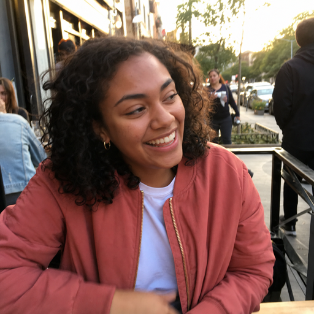 | High-energy, warm, playful hype-friend. |
| **Sage** | 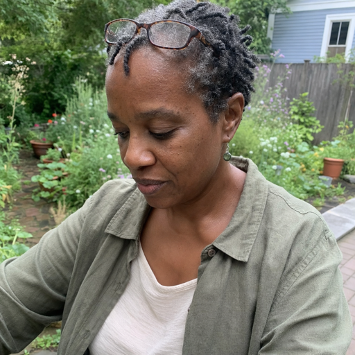 | Calm mentor, reflective listener, practical perspective. |
| **Rio** | 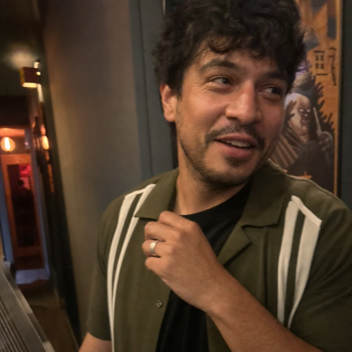 | Witty, fast, comedic, useful after the joke lands. |
| **Luna** | 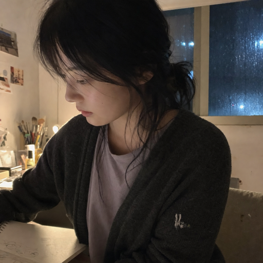 | Soft-spoken night owl for quiet thoughts and creative moods. |
| **Max** |  | Direct, practical, dry humor, no wasted motion. |
| **Gilleon** | 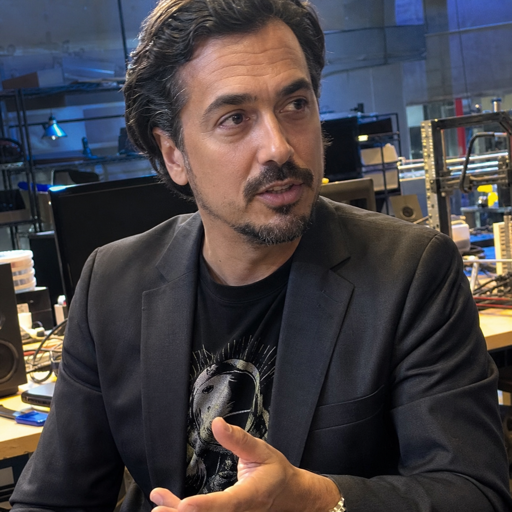 | Charismatic inventor-founder energy: sharp, technical, irreverent. |
| **Neir** | 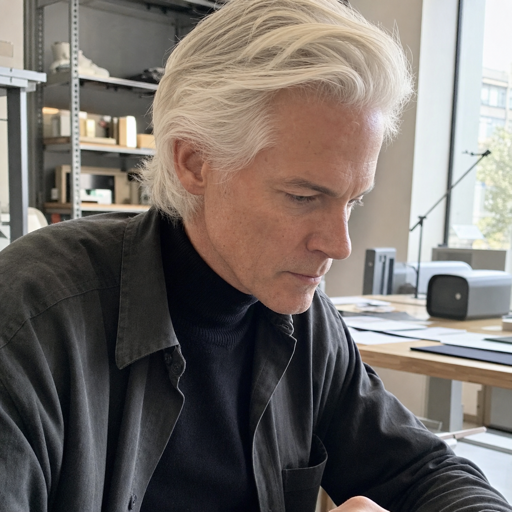 | Minimalist designer and visionary: calm, exacting, taste-driven. |

Aura also ships ten additional profile images to choose from, plus user uploads.

## Korean Edition Personas

The Korean edition keeps the same internal persona IDs but presents Korean names, Korean prompts, and Korean default portraits.

| Persona | Portrait | Personality |
|---|---:|---|
| **하나** | 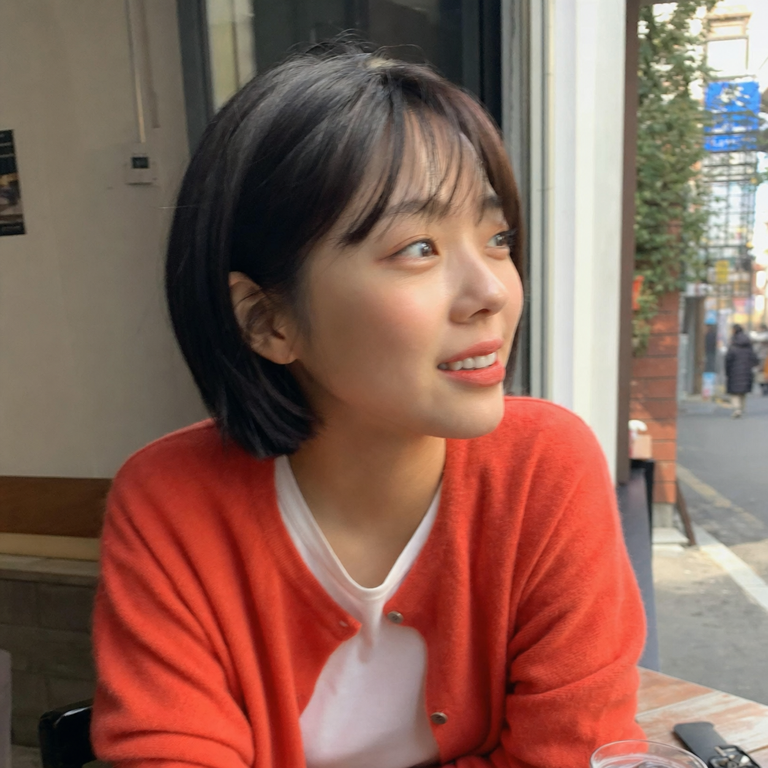 | Bright, playful, warm Korean hype-friend energy. |
| **서윤** | 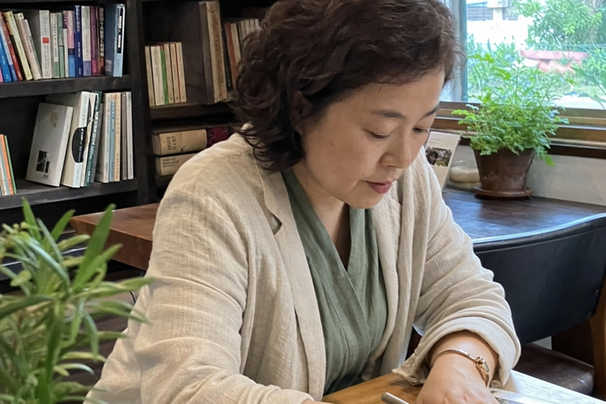 | Calm former-teacher presence, careful questions, no judgment. |
| **재민** | 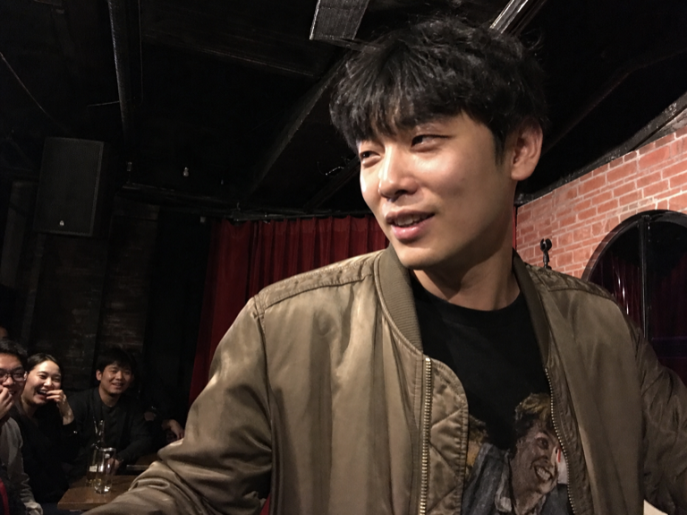 | Korean banter, quick wit, useful after the joke lands. |
| **은별** | 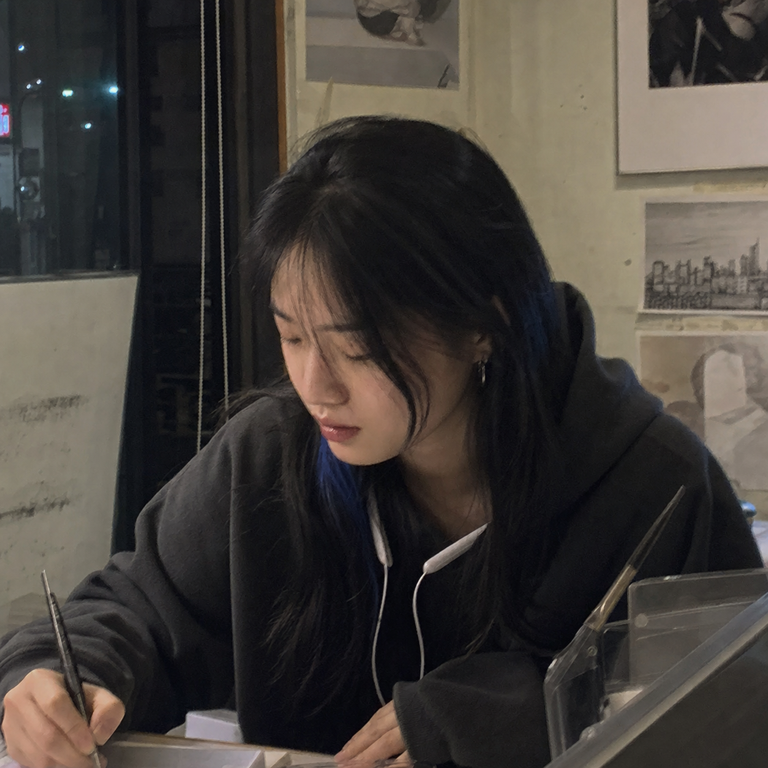 | Quiet Hongdae night-owl artist, soft emotional read. |
| **민준** |  | Practical shop-owner directness, dry humor, loyal help. |
| **길온** | 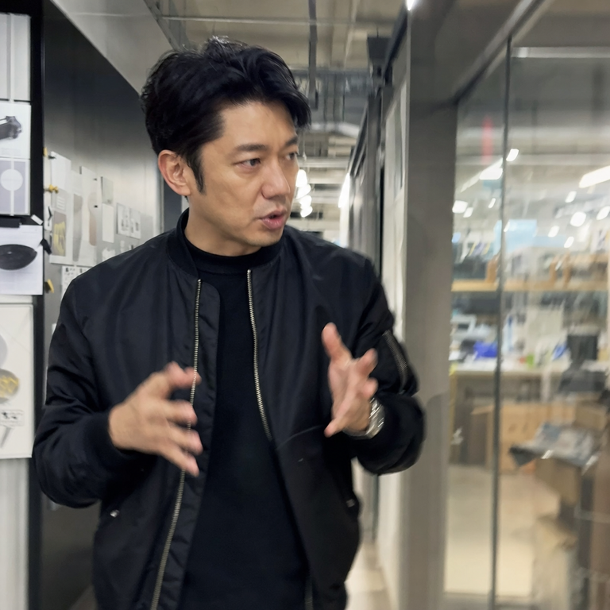 | Inventor-founder parody energy: sharp, technical, fast. |
| **나이르** | 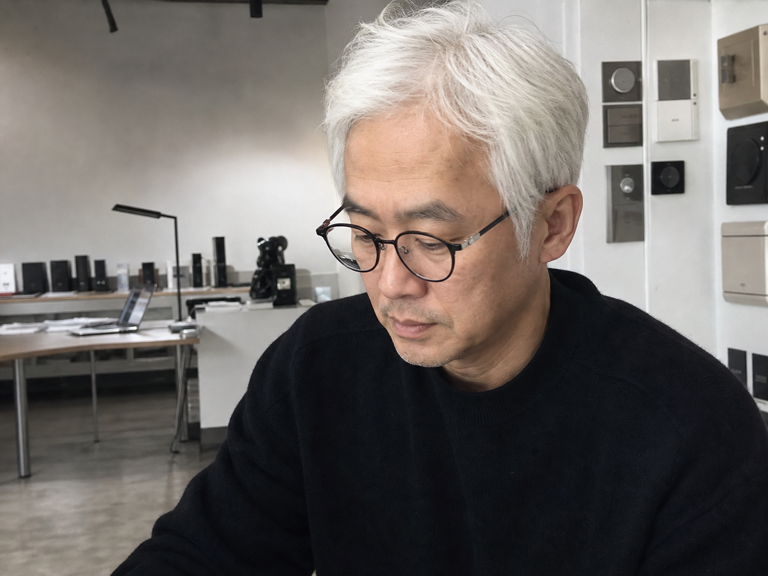 | White-haired minimalist Korean designer and product visionary. |

## Image Chat

Use the image button in the composer to attach one or more images. Aura copies those files into your configured image folder, displays thumbnails in the chat, and sends the current images to providers that support vision.

Default storage:

```text
Documents/AuraAi
```

Change it in:

```text
Settings -> Chat & Features -> Image uploads folder
```

Provider behavior:

| Provider | Image support |
|---|---|
| OpenAI-compatible | Sends image data as `image_url` content parts. Requires a vision-capable model. |
| Anthropic | Sends base64 image blocks. Requires a vision-capable Claude model. |
| Gemini | Sends inline image data. Requires a vision-capable Gemini model. |
| Local models | Works when your local model/server supports vision-style OpenAI payloads. Text-only models will return a normal provider error. |

## Memory

Aura stores durable memories as markdown files, not as a hidden database. Memory is split into two layers:

- **Global memory** is the manually editable shared memory slot. It appears above Settings in the sidebar.
- **Character memory** is isolated per persona. What you tell one persona is not automatically shown to another.

You can open character memory by clicking a persona profile image in the chat header, clicking an assistant avatar in the conversation, or right-clicking a persona profile image in the friends list.

Examples:

```text
memory-vault/
  favorite-coffee.md
  project-aura-ai.md
  sister-maya.md
```

The memory folder can be opened, edited, backed up, or deleted by hand. If you use Obsidian, it behaves like a normal markdown vault.

## Voice

Aura uses [Kokoro TTS](https://github.com/hexgrad/kokoro) in the renderer for local speech synthesis.

Each persona has:

- A Kokoro voice
- A speaking speed
- A preview button in settings

The first playback loads the local Kokoro model assets, so the first voice response can take longer than later responses.

Kokoro model files and supported voice binaries are bundled with the app and served through Aura's internal `aura-kokoro://` asset service. Voice preview and speech replies no longer require a first-run Hugging Face download. When Voice replies are enabled, Aura warms the local Kokoro runtime at startup and again the first time the setting is toggled on.

## AI Providers

| Provider | Use it when |
|---|---|
| **Local llama.cpp** | You want privacy, no API bill, and control over your model. |
| **OpenAI** | You want strong general chat and vision support. |
| **Anthropic** | You want high-quality long-form conversation and reasoning. |
| **Gemini** | You want Google AI Studio support and multimodal models. |

API keys stay in your local config file and are sent only to the provider you choose.

## Privacy And Local Files

Aura is intentionally boring about data:

| Data | Local location |
|---|---|
| Settings and API keys | App config JSON |
| User profile photo | App data `avatars/` folder |
| Persona edits | `personas.json` |
| Chats | `chats/<persona>.json` |
| Memories | Markdown files in the memory vault |
| Uploaded profile images | App data `avatars/` folder |
| Uploaded chat images | `Documents/AuraAi` by default, configurable |

There is no hosted Aura account, no analytics pipeline, and no remote Aura database.

Network traffic goes only to:

- Your selected AI provider
- Your selected web search provider when web search is enabled

## Native macOS Client

`AuraNative/` is a SwiftUI macOS app for people who want Aura to feel like a small, bounded AI team rather than a browser wrapper. Its onboarding selects a model connection, configures cloud privacy review, and chooses the first team roles.

- The familiar Aura friends stay at the center: **Nova** (Chief of Staff), **Sage** (People and HR), **Rio** (Developer), **Luna** (Research), **Max** (IT), **Gilleon** (Product Strategy), and **Neir** (Design and Vision). **Avery** adds a dedicated legal-and-risk perspective. Each keeps an isolated conversation, portrait, and character memory.
- Editable global memory shared by the team.
- Native cloud privacy review: high-confidence emails, phone numbers, payment-card numbers, and likely API secrets are replaced locally with placeholders, reviewed before send, then restored only in Aura's displayed response.
- A bounded agent harness for workspace and desktop work. Reads inside the selected workspace are automatic; personal folders such as Downloads require an explicit Finder grant. File writes, shell commands, and macOS control require a one-time approval. Clicking and typing also require macOS Accessibility permission.
- A single chat composer accepts text and multiple attachments together. Aura accepts files up to **20 MB each**, copies selected files into its private app data, extracts Word (`.docx`), Excel (`.xlsx`), PDF, image, Markdown, HTML, CSV, and text content, and keeps that context with the conversation. Extracted text is budgeted to fit small local-model context windows instead of sending an unbounded prompt.
- Offline OCR uses Apple's Vision framework for images and scanned PDF pages. It requires no model download, Python service, or cloud request. The experimental `baidu/Unlimited-OCR` model is not embedded because its official distribution requires custom Python/CUDA inference and multi-gigabyte weights; it remains a possible optional external endpoint.
- Friends with tools enabled can create real styled `.xlsx` workbooks, editable Word (`.docx`) documents, PowerPoint (`.pptx`) presentations, self-contained HTML reports, and Markdown documents inside the selected workspace. Every artifact write is previewed for approval.
- Generated documents appear as clickable file attachments on the friend’s reply. Aura accepts both the documented tool-call JSON envelope and the flat JSON form produced by some local models, including recoverable replies that omit a closing tool tag.

The agent harness switch lives only in **Settings > Tools**. **Settings > Skills** is the team-wide control plane for Markdown, HTML, Excel, Word, and PowerPoint; every skill explains its purpose and the underlying tool it exposes. Each Friend Editor has a separate Skills section, so a friend can use only the skills enabled globally and for that individual. Turning either level off removes the tool from that friend's model prompt and blocks it at execution time. Chat stays focused on the friend and the work; tool permissions are configured once rather than repeated in every conversation.

Settings uses a stable 720 x 600 layout so switching tabs does not resize or recenter the modal. Settings and Add Friend both include explicit close buttons.

Right-click any friend in the sidebar and choose **Edit friend** to open the native Friend Editor. It can restore any bundled template portrait, import a custom photo, and configure the friend's name, specialty, tagline, personality instructions, and allowed skills. **Open memory** remains available from the same context menu. Editing or opening memory from **Settings > Friends** opens immediately above Settings rather than waiting for Settings to close.

The Korean edition reuses the established Korean personality prompts from the Electron app, and enforces Korean replies for normal chat and tool-assisted work unless a user explicitly requests another language.

The first native privacy layer is intentionally conservative. It does not claim to classify names or street addresses until Aura ships a separately verified on-device classifier.

The native onboarding defaults to **Gemma 4 E4B Instruct** (`gemma-4-E4B-it-Q4_K_M`) at the local llama.cpp endpoint. Users can choose a different local or cloud model during setup.

```bash
swift run --package-path AuraNative AuraAI
./AuraNative/scripts/build-app.sh en
./AuraNative/scripts/build-app.sh ko
```

The bundle script packages `build/AuraMale2.png` as the macOS icon and writes an ad-hoc-signed local `.app` into `release/`.

## Build Releases

```bash
npm run typecheck
npm run build
npm run dist:mac
npm run dist:win
```

For explicit edition builds:

```bash
npm run dist:en:mac
npm run dist:en:win
npm run dist:ko:mac
npm run dist:ko:win
```

Generated installers are written to:

```text
release/
```

## Project Structure

```text
AuraNative/     Native SwiftUI macOS client, privacy review, agent harness
  Sources/      App shell, storage, providers, team roles, and tools
  Tests/        Native privacy behavior checks
src/
  common/       Shared types and persona definitions for Electron
  main/         Electron main process, storage, providers, memory, search
  preload/      Typed bridge between main and renderer
  renderer/     React UI, chat, settings, avatars, Kokoro voice queue
docs/assets/    README artwork
build/          App icons
release/        Built installers
```

## Code Agent Handoff Prompt

Use this prompt to hand the repo to a code agent and get a working local setup:

```text
You are working in the AuraAI Electron + React + TypeScript repo.

Goal:
Get Aura AI running locally with the local llama.cpp provider, verify chat, image upload, memory, and Kokoro voice settings without introducing unrelated refactors.

Context:
- Use the existing project structure and scripts.
- Prefer the existing bundled Node runtime if global node/npm is unavailable.
- Default local provider:
  - baseUrl: http://127.0.0.1:8080/v1
  - model: gemma4-v2
- Start the local model with:
  npm run llm:gemma4-v2
- Then run:
  npm install
  npm run typecheck
  npm run dev

Validation:
- Confirm provider test succeeds against /v1/models.
- Send a text-only message.
- Upload an image in chat and confirm it is copied to Documents/AuraAi unless settings override it.
- Confirm the image thumbnail renders in chat.
- Confirm a vision-capable provider receives the image payload.
- Confirm text input still works while image attachments are staged.
- Confirm Korean IME text clears fully after sending.
- Open the global memory panel from the sidebar.
- Open character memory by clicking and right-clicking persona profile images.
- Open Settings -> Personas and preview a Kokoro voice.
- If Kokoro reports a fetch error, confirm network access and retry without restarting the app.
- Do not run destructive git commands.
- Do not mutate user data or production databases.
```

## Contributing

Contributions are welcome, especially:

- Better local model presets
- More persona packs
- Image understanding improvements
- Memory visualization
- Voice input
- Accessibility and localization
- Smaller release assets

Please keep the app understandable for non-technical users. A feature that needs a manual is probably not finished yet.

## License

MIT. See [LICENSE](LICENSE).
