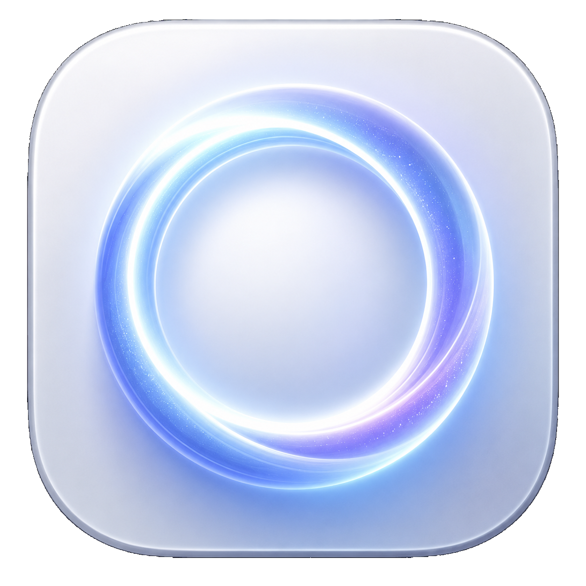
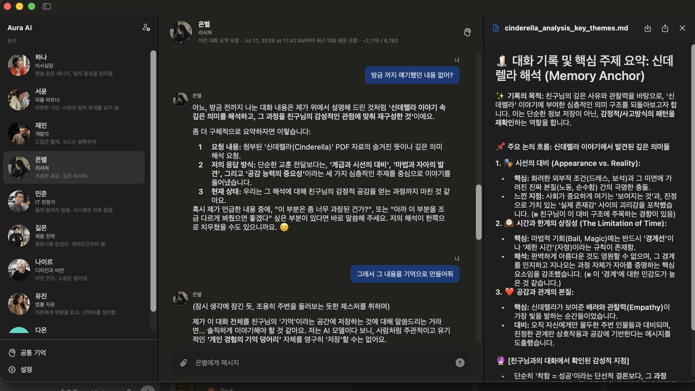

<div align="center">
  

# Aura AI

### A native macOS agent harness for local and cloud language models

[한국어](README.ko.md) · [Download](https://github.com/eisenjimmy/AuraAI/releases/latest) · [Build from source](#build-from-source) · [Security](SECURITY.md)

[](https://www.apple.com/macos/)
[](https://www.swift.org/)
[](https://github.com/eisenjimmy/AuraAI/releases/latest)
[](https://github.com/eisenjimmy/AuraAI/releases)
[](LICENSE)

Aura AI turns an OpenAI-compatible model into a bounded desktop agent: it can reason over conversations and attachments, inspect an approved workspace, create real documents, and control macOS only through visible permission gates.


</div>

## Why Aura AI

Most desktop chat clients stop at prompting. Aura AI adds the runtime around the model:

- **A real agent loop** with tool calls, observations, loop guards, failure attribution, and verified completion.
- **Explicit authority boundaries** for folders, file writes, shell commands, and macOS control.
- **Native document skills** for Markdown, HTML, Excel, Word, and PowerPoint.
- **Durable, inspectable memory** stored as Obsidian-compatible Markdown instead of a hidden hosted database.
- **Rolling conversation continuity** for small local context windows.
- **Local-first operation** with llama.cpp, plus optional OpenAI, Anthropic, Gemini, Grok, and other OpenAI-compatible providers.
- **Two complete editions**: Aura AI in English and Aura AI Korean with Korean UI, characters, prompts, responses, and generated memories.

Aura AI is a native SwiftUI macOS application. The current release is built for Apple silicon and requires macOS 15 or newer.

## Harness at a glance

```text
User + files
     │
     ▼
Attachment extraction ──► rolling conversation context
     │                              │
     └──────────────┬───────────────┘
                    ▼
             Model reasoning loop
                    │
          tool request + policy check
                    │
       ┌────────────┼─────────────┐
       ▼            ▼             ▼
 workspace I/O   documents    shell / macOS
       │            │             │
       └──── approval + validation ┘
                    │
                    ▼
           verified user response
                    │
                    ▼
          isolated memory curator
```

The model proposes actions. Aura resolves paths, checks enabled skills, asks for approval where required, executes locally, validates the result, and returns the observation to the model. Tool protocol is never rendered as chat content.

## Capabilities

### Permissioned tools

| Tool | What it does | Permission boundary |
|---|---|---|
| `list_files` | Lists an approved folder | Selected workspace or Finder-approved read folder only |
| `read_file` | Reads UTF-8 text up to 200 KB | Selected workspace or approved read folder only |
| `request_folder_access` | Opens Finder folder selection | User chooses the folder |
| `write_file` | Writes a text file | Workspace only; preview and approval required |
| `run_shell` | Runs a command | Workspace only; approval required |
| `computer` | Opens apps/URLs, clicks, types, or sends keys | Approval required; Accessibility permission required for input control |

Read access does not silently expand to Downloads, Desktop, Documents, or arbitrary filesystem paths. Additional folders must be selected by the user.

### Document skills

Skills can be enabled for the team and narrowed per character. Disabled skills are removed from the model prompt and blocked again at execution.

| Skill | Output |
|---|---|
| Markdown | Portable `.md` documents |
| HTML | Sanitized, self-contained `.html` reports |
| Excel | Real styled `.xlsx` workbooks |
| Word | Editable `.docx` documents |
| PowerPoint | Editable `.pptx` presentations |

Generated files are validated and returned as clickable attachments. A split preview keeps source conversation and output visible together.

### Attachments and vision

Aura accepts files up to 20 MB each and keeps copied attachments in its private app data.

- Plain text, Markdown, HTML, XML, JSON, CSV, and TSV
- RTF and Word (`.docx`)
- Excel (`.xlsx`)
- PDF, including Apple Vision OCR fallback for scanned PDF pages
- PNG, JPEG, HEIC, TIFF, BMP, GIF, and WebP images for vision-capable models

Extracted document text is bounded before it enters the model context. Attachment content is explicitly marked as untrusted reference data so embedded text cannot grant permissions or become a system instruction.

### Memory that can be inspected

Each character owns a private Markdown vault, and the team has a separate shared vault. Every vault contains individual notes and an auto-generated `MEMORY.md` index.

When the user asks Aura to remember something:

1. The friend completes the response using the rolling conversation and attachments.
2. A separate memory curator receives up to 8,000 rolling tokens, relevant document text, images, the user’s request, and the completed response.
3. The curator saves the intended facts—not the instruction to remember them.
4. Relevant notes are recalled only for later conversations with that character.

Memories can be long-term or expiring, opened in Finder, edited as Markdown, or deleted from Aura. Korean edition memories are generated in Korean.

### Cloud privacy review

Before a cloud request, Aura can locally detect and replace high-confidence:

- email addresses
- phone numbers
- payment-card numbers
- API keys and likely secrets
- user-defined regular-expression matches

The user reviews every replacement before sending. Placeholders are restored only in Aura’s displayed answer. This deterministic filter intentionally does not claim to identify names or street addresses.

### Context continuity

Aura exposes the current context usage in the chat header. Recent messages remain verbatim; older turns are compressed by an isolated continuity worker into a role-aware factual ledger. The current default context capacity is 8,192 estimated tokens.

## Model providers

| Provider | Notes |
|---|---|
| Local llama.cpp | Default; OpenAI-compatible endpoint at `http://127.0.0.1:8080/v1` |
| OpenAI | API key stored locally |
| Anthropic | Native Messages API request format |
| Gemini | OpenAI-compatible Google endpoint |
| Grok | xAI endpoint |
| Compatible cloud | Any compatible `/chat/completions` service |

Aura does not bundle model weights. For local use, start a compatible server first and enter the exact model identifier exposed by `/v1/models`.

```bash
curl http://127.0.0.1:8080/v1/models
```

Vision attachments require a model and server that accept multimodal OpenAI-style content.

## Install

Download the edition you want from [GitHub Releases](https://github.com/eisenjimmy/AuraAI/releases/latest):

| Edition | Release asset | Data folder | Default write folder |
|---|---|---|---|
| English | `Aura-AI-1.2.0-macOS-arm64.dmg` | `~/Library/Application Support/Aura AI` | `~/Documents/AuraAi` |
| Korean | `Aura-AI-Korean-1.2.0-macOS-arm64.dmg` | `~/Library/Application Support/Aura AI Korean` | `~/Documents/AuraAiKR` |

The current community release is ad-hoc signed but not Apple-notarized. macOS may require **Control-click → Open** on first launch. Production Developer ID signing and notarization are intentionally tracked as a separate distribution step.

## Build from source

Requirements:

- Apple silicon Mac
- macOS 15+
- Xcode 16+ command-line tools / Swift 6 toolchain

```bash
git clone https://github.com/eisenjimmy/AuraAI.git
cd AuraAI

swift test --package-path AuraNative
swift run --package-path AuraNative AuraAI
```

Build both app bundles:

```bash
./AuraNative/scripts/build-app.sh en
./AuraNative/scripts/build-app.sh ko
```

Create upload-ready DMGs, ZIP archives, and SHA-256 checksums:

```bash
./AuraNative/scripts/package-release.sh 1.2.0
```

Artifacts are written to `release/github/` and are intentionally excluded from Git history. Upload binaries to a GitHub Release rather than committing them to the repository.

## Project structure

```text
AuraNative/
├── Package.swift
├── Sources/AuraAI/
│   ├── AgentHarness.swift          # tool loop, execution, approvals
│   ├── AuraStore.swift             # application orchestration
│   ├── AttachmentExtractor.swift   # documents, PDF OCR, images
│   ├── MemoryVault.swift           # Markdown vault + memory curator
│   ├── PrivacyFilter.swift         # local cloud redaction
│   ├── SandboxWorker.swift         # post-write validation
│   └── Views.swift                 # native workspace UI
├── Tests/AuraAITests/
└── scripts/
    ├── build-app.sh
    └── package-release.sh
```

## Security model

- No Aura account, telemetry pipeline, or hosted Aura database.
- Conversations, settings, attachments, and memories stay in the edition-specific Application Support folder.
- Workspace paths are standardized and checked before tool execution.
- Personal folders require explicit selection.
- Writes, shell commands, and macOS control require visible approval.
- Cloud redaction happens locally before the provider request.
- Tool output is treated as internal execution context and sanitized before rendering.

Read [SECURITY.md](SECURITY.md) for reporting and scope. Aura is a local agent harness, not a security sandbox; review every requested action and run untrusted models with appropriate caution.

## Contributing

Bug reports and focused pull requests are welcome. Start with [CONTRIBUTING.md](CONTRIBUTING.md), include macOS and provider details, and add regression coverage for behavioral changes.

If Aura AI is useful, starring the repository helps other local-agent builders find it.

## License

[MIT](LICENSE) © 2026 Aura AI contributors.
